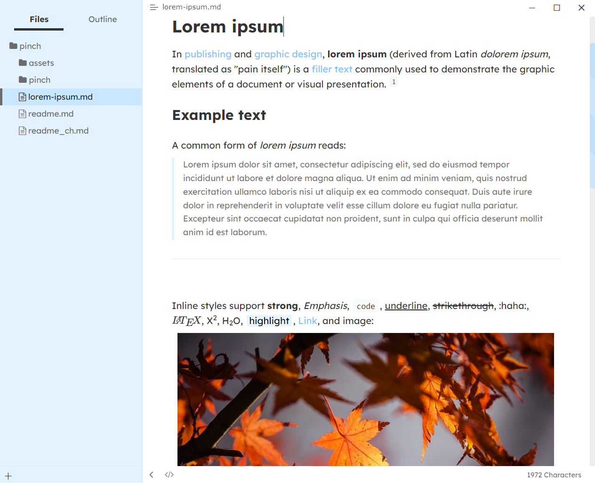
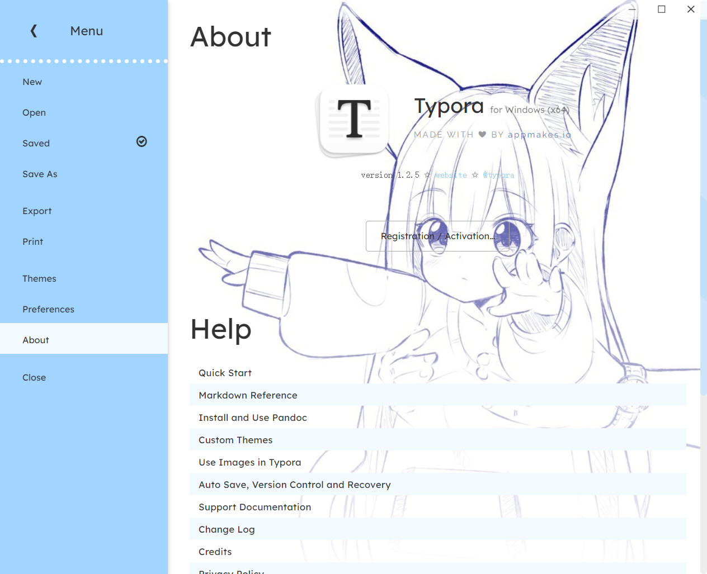

# typora-pinch-theme

简体中文 | [English](README.md)

 

  
/* 蓝蓝的很可爱... ...如果你喜欢本主题请给咱小星星！ */

 

## 简介

一个没什么特色的 typora 主题，偏向于自用，提供测试和分享。

在 Windows 环境下设计和测试，在其他系统下出现问题敬请谅解。

由于咱真的很菜，该主题可能存在大量问题，在未来的版本会修复。

如果有好的想法~~请致电~~欢迎提交 issue 或 pr。

在使用本主题时血压升高，可以来教咱做事。

 

 

## 效果展示

original

  

 

 

## 下载和安装

Install Typora.

Download [release](), unpack and drop all the files into `general` -> `themes` -> `open theme folder`

 

 

## 呜谢

可爱的插画：[nisp_art (@art_nisp) / Twitter](https://twitter.com/art_nisp)

字体：[typora-mint-theme](https://github.com/Y1chenYao/typora-mint-theme)

 

 

## 计划

- [ ] 调整代码块中字体颜色

- [ ] 支持其他 OS 

- [ ] 正在想... ...

