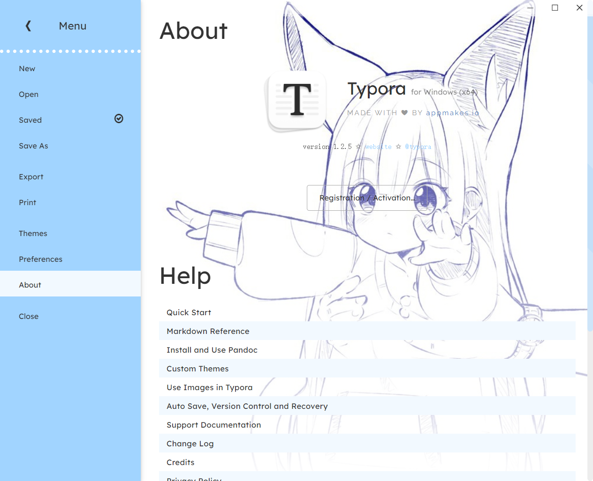

# typora-pinch-theme

English | [简体中文](READMEzh_CN.md)

 

  
/* A sky-blue theme for typora. */

 

## Intro

Awesome background: [nisp_art (@art_nisp) / Twitter](https://twitter.com/art_nisp)

Reference design from [typora-mint-theme](https://github.com/Y1chenYao/typora-mint-theme)

I love them so much!

 

 

## Preview

original

  

 

 

## Installation

Install Typora.

Download [release](https://github.com/namolite/typora-pinch-theme/releases), unpack and drop all the files into `general` -> `themes` -> `open theme folder`

 

 

## Feature

- None.
- Coming soon...💦
